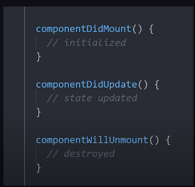

# React-Hooks-Guide

# React Hooks
- UI components are often dynamic and may need to change state of data, react to lifecycle events and access elements of the DOM etc.
- Hooks provide an ergonomic way to build components - as you can reuse stateful logic without changing your component hierarchy
- React provide 10 built-in Hooks
- In the past, stateful logic was tightly coupled to a class component
- Low-level primitives/building block of React
- Hooks are functions that always start with the word `use`

# Rules of using Hooks
1) Call them in top-level of a functional component; Do not work in regular JS functions/nested functions/loops
2) Only exception is if you use custom Hooks

## `useState()`
- The most important and often used Hook
- Handle reactive data; any data that changes in the application is called **state**

### Example code of useState()
<details open>
   <summary>Code of useState() </summary>

   ```jsx
      import {useState} from 'react';
      function App() {
         // state, setter function that changes the state
         const [count, setCount] = useState(0);
         return <></>;
      }       

   ```
</details>

## `useEffect()`
- Need to understand the component lifecycle 
  

  

- useEffect is a function that takes a function you define as its first argument

- React will then run the function/side effect after it has updated the DOM 

- The first argument of `useEffect()` is a (side effect) function that is called as the side effect when the component first renders and sometimes when stateful data changes - dependning on the dependency array passed in

- The second argument of `useEffect()` is the dependency array which are the dependencies of the Hook

  - An empty dependency array will only result in the side effect function being called **once** - when the component first renders
  - We can add in states to the dependency array so that the side effect function will be called again when that dependent state changes

## Example of useEffect() 

<details open>
   <summary>Code of useEffet() </summary>


   ```jsx
      import {useState} from 'react';
      function App() {
         // state, setter function that changes the state
         const [count, setCount] = useState(0);
         const [loaded, setLoaded] = useState(false);
         
         // No dependency array passed in - Runs everytime
         // 1) component mounted
         // 2) component updates (state changes)
         useEffect(() => {
             alert("Hello side effect!")
         })
          
         // More fine-grained control
         // This results in infinite loop
         // Everytime fetch, we update state, which triggers fetch again, so on & so forth          
         useEffect(() => {
             fetch('foo').then(() => setLoaded(true))
         })
          
         // We pass in dependency array to have more control
         // Empty array: No dependencies; Run only once when the component first initialises 
         useEffect(() => {
             fetch('foo').then(() => setLoaded(true))
         }, [])
          
         // Re-run the function any time certain stateful data has changed
         // Add the state to the dependency array
         // In this case, the fetch is only called when the component first initialises
         // and when the `count` state changes
         useEffect(() => {
             fetch('foo').then(() => setLoaded(true))
         }, [count])
          
         // Tear down function - before component removed from UI
         useEffect(() => {
            alert('hello side effect!')
            return () => alert('goodbye component!') 
         })
          
         return (<></>);
      }       

   ```

</details>


## `useContext()`
- React's context API to share or scope value throughout entire component tree
- `ContextProvider` to scope the value in a parent component and any child component down the tree can access this value and we do not need to pass down the value via props
- When the context value in the parent component changes, it is automatically updated in the child components
- Child component consumes context value from the nearest parent provider

### Example code of useContext()
<details open>
   <summary>Code of useContext() </summary>

   ```jsx
const moods = }
	happy: ":)",
	sad: ":(",
}

// Create a MoodContext that can be used to provide
// context to components
const MoodContext = createContext(moods);

function App(props) {
	return (
		<MoodContext.Provider value={moods.happy}>
			// Any child component here will inherit the 
			// context value without needing to use props
			// to pass down to children and will be able to use it
			<MoodEmoji />
			
		</MoodContext.Provider>
	);
}

function MoodEmoji() {
	// Access or consume the current value from the context provider
	// which may live many levels higher in the component tree
	// If the value changes from 'happy' to 'sad' in the parent provider
	// it will be updated automatically 
	const mood = useContext(MoodContext);
	return <p> { mood } </p>
}
   ```
</details>


## `useRef()`
- Accepts one argument as the initial value and returns a *reference*
- A reference is an object having a special property `current`
- Create a mutable object that will keep the same reference between renders
- It can be used when you have a value that changes like `setState()`, the difference being it does not trigger a re-render when the value changes
- Mutable value does NOT re-render UI
- More common use case for `useRef()` is to grab native HTML elements from DOM

### Example code of useRef()
<details open>
   <summary>Code of useRef() </summary>

```jsx
import { useRef } from 'react';
function MyComponent() {
  const reference = useRef(initialValue);
  const someHandler = () => {
    // Access reference value:
    const value = reference.current;
    // Update reference value:
    reference.current = newValue;
  };
  // ...
}
```

</details>


`reference.current` accesses the reference value, and `reference.current = newValue` updates the reference value

### 2 Rules to remember about references
1. The value of the reference is **persisted** (stays the same) between component re-renderings
2. Updating a reference does not trigger a component re-rendering

### Difference between reference and state
1. Updating a reference does not trigger re-rendering, but updating the state makes the component re-render
2. The reference update is synchronous (the updated reference value is available right away), while the state update is *asynchronous* (the state variable is updated after re-rendering)

From a higher point of view, references store infrastructure data of side-effects, while the state stores information that is directly rendered on the screen

### Example for accessing DOM elements
Another useful application of the useRef() hook is to access DOM elements. This is performed in 3 steps:

1. Define the reference to access the element `const elementRef = useRef();`
2. Assign the reference to ref attribute of the element: `<div ref={elementRef}></div>;`
3. After mounting, `elementRef.current` points to the DOM element.

<details open> 
   <summary>Code example for accessing DOM elements</summary>

```jsx
import { useRef, useEffect } from 'react';
function AccessingElement() {
  const elementRef = useRef();
   useEffect(() => {
    const divElement = elementRef.current;
    console.log(divElement); // logs <div>I'm an element</div>
  }, []);
  return (
    <div ref={elementRef}>
      I'm an element
    </div>
  );
}
```
</details>

#### Use case: focusing an input
- One possible use case is to focus on the input field when the component mounts
- Create a reference to input and assign the reference to `ref` attribute of the tag, and after mounting call the special method `element.focus()` on the element

<details open>
  <summary>Code Example: Focusing an input field</summary>

```jsx
import { useRef, useEffect } from 'react';
function InputFocus() {
  const inputRef = useRef();
  useEffect(() => {
    inputRef.current.focus();
  }, []);
  return (
    <input 
      ref={inputRef} 
      type="text" 
    />
  );
}
```

</details>


## `useReducer()`
- Similar to `setState()` but using Redux pattern
- Instead of updating the state directly, actions are dispatched to the reducer function and that reducer function determines how to compute the next state
- Returns an array of two values: 1) The state, 2) function that dispatch an action (object that has a type and optional data payload)

### Example code of `useReducer()`
<details open>
   <summary>Code of useReducer()</summary>

   ```jsx
   function reducer(state, action) {
      switch(action.type) {
         case 'increment':
            return state + 1;
         case 'decrement':
            return state - 1;
         default:
            throw new Error();
      }
   }
   function App() {
     // [The State like state in useState(), dispatch function (type + optional data payload)]
     // useReducer(reducer function, initial state)
     const [state, dispatch] = useReducer(reducer, 0);
     return ( 
        <>
           Count: {state}
           <button onClick={() => dispatch({type: 'decrement'})}> - </button>
           <button onClick={() => dispatch({type: 'increment'})}> + </button>
        </>
     ) 
   }
   ```
</details>

- Reducer function is defined by you and passed as argument to the `useReducer()` hook
- The function takes the current state and action as arguments and uses these values to compute the next state which is usually handled inside a switch statement

## `useMemo()`
- Optimise computation calls for improved performance
- Cache result of function call (memoization); use only as needed for expensive calculations
- Imagine you have an expensive computation, `expensiveCount()` on top of the count `useState()` hook
- Instead of re-computing on every render, we can memoize the value - write a function that returns the computed value and add dependency in the dependency array

### Example code of `useMemo()`
<details open>
   <summary>Code of useMemo()</summary>

   ```jsx
      function App() {
         const [count, setCount] = useState(60);
         const expensiveCount = useMemo(() => {
            return count ** 2;
         }, [count])
         
         return <> </>;
      }
   ```
</details>


## `useCallback()`
- Hook used to memoize an entire function
- When you define a function in a component, a new function object is created each time your component is re-rendered.
- In some cases, you might want to memoize the function to improve performance
- A use case is when you pass this same function to multiple child components
- Prevent unnecessary re-renders of the children as they will always be using the same function object
